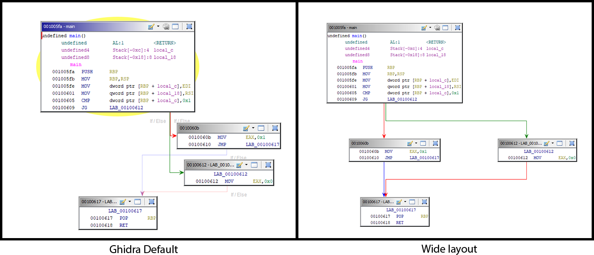
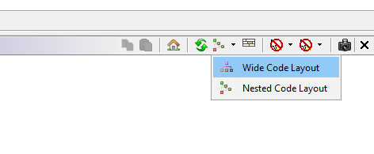

# Ghidra Wide Graph Layout

This plugin implements an alternative layout for the Ghidra's Function Graph.

The new layout can be selected from the top bar of the Function Graph widget.

### Disclaimer
Do not expect nothing special, it is a (probably broken) early release.

### Installation
Go to release, download the zip, open Ghidra, click on `File/Install Extensions...` and select the zip.
